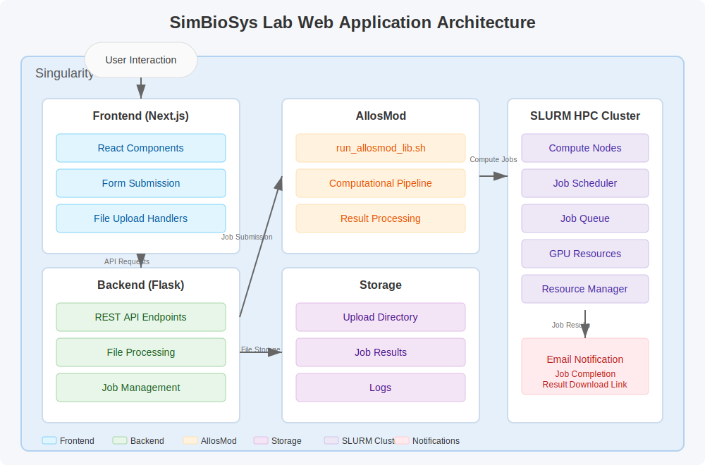

# SimBioSys Lab Web Server

A web interface for submitting protein structure analysis tasks to the AllosMod modeling platform.

## Architecture Diagram



## Overview

This application consists of:

1. **Frontend**: A Next.js React application with a modern UI for file uploads and job configuration
2. **Backend**: A Flask-based Python API that processes uploads and submits jobs to a SLURM cluster
3. **AllosMod Processing**: Shell scripts that run the AllosMod computational pipeline on submitted files

## Directory Structure

```
SimBioSys Lab/
├── Web Server/              # Web interface
│   ├── frontend/            # Next.js UI
│   └── backend/             # Flask API
├── allosmod_inputs/         # AllosMod scripts and data
│   ├── run_allosmod_lib.sh  # Main AllosMod execution script
│   └── uploads/             # User uploaded files
└── singularity.def          # Singularity container definition
```

## Containerization

The application is containerized using Singularity, which is the preferred container platform for HPC environments. Docker configuration is also provided for development purposes.

### Singularity Container

The entire web server is packaged into a single Singularity container that includes:
- Python backend
- Node.js frontend
- All dependencies and runtime environment

To build the Singularity container:

```bash
# Make the build script executable
chmod +x build-singularity.sh

# Run the build script
./build-singularity.sh
```

To run the container:

```bash
singularity run simbiosys-webserver.sif
```

To run as a service:

```bash
singularity instance start simbiosys-webserver.sif webserver
```

### Docker (Development)

For development, you can use Docker Compose:

```bash
docker-compose up
```

This will start:
- Backend API on port 8000
- Frontend on port 3000
- AllosMod service container

## Setup Instructions

### Prerequisites

- Node.js 18+ and npm
- Python 3.8+
- SLURM cluster with AllosMod installed
- Environment variables configured (see below)

### Environment Configuration

#### Backend Configuration (.env file in backend directory)

```
# Server Configuration
FLASK_ENV=development
HOST=0.0.0.0
PORT=8000
DEBUG=True

# Path Configuration
UPLOAD_FOLDER=../allosmod_inputs/uploads
TEMPLATE_FOLDER=./templates
MAX_CONTENT_LENGTH=16777216  # 16MB in bytes
ALLOSMOD_SCRIPT_PATH=../allosmod_inputs/run_allosmod_lib.sh

# SLURM Configuration
SLURM_PARTITION=gpu
SLURM_GPUS=h200:1
SLURM_MEMORY=128G
SLURM_TIME=08:00:00

# Email Configuration (for notification emails)
SMTP_SERVER=smtp.example.com
SMTP_PORT=587
SMTP_USER=user@example.com
SMTP_PASSWORD=your_password_here
EMAIL_FROM=SimBioSys Lab <no-reply@example.com>
EMAIL_SUBJECT=SimBioSys Lab: Your job has been processed

# File.io API (for sharing results)
FILEIO_API_URL=https://file.io/
```

#### Frontend Configuration (.env file in frontend directory)

```
# API URLs
NEXT_PUBLIC_API_URL=http://localhost:8000

# UI Configuration
NEXT_PUBLIC_MAX_FILES=10
NEXT_PUBLIC_MAX_FILE_SIZE_MB=16
```

## Starting the Application

### Backend (Flask API)

```bash
cd Web\ Server/backend
python -m venv venv
source venv/bin/activate  # On Windows: venv\Scripts\activate
pip install -r requirements.txt
python web_service.py
```

### Frontend (Next.js UI)

```bash
cd Web\ Server/frontend
npm install
npm run dev
```

The application will be available at http://localhost:3000

## Usage

1. Access the web interface
2. Upload PDB, ZIP, or other supported files
3. Configure the number of runs and provide contact information
4. Submit the job
5. Receive email notification when processing is complete

## Supported File Types

- ZIP archives (.zip)
- TAR archives (.tar, .gz, .tgz)
- PDB structure files (.pdb)
- CIF structure files (.cif)
- FASTA sequence files (.fasta, .seq)
- Input data files (.dat)

## Troubleshooting

- Check the log files in `backend/app.log` for API errors
- SLURM job logs are available in the configured LOGS_DIR
- Ensure all directories have proper write permissions
- Verify that the AllosMod script path is correctly configured

## Contact

For questions or issues, contact the SimBioSys Lab administration (simbiosyslab.neu@gmail.com).
